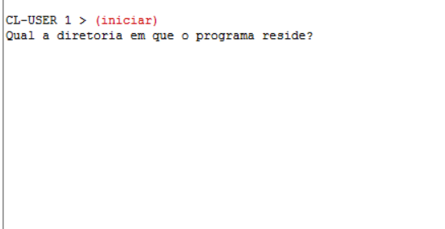
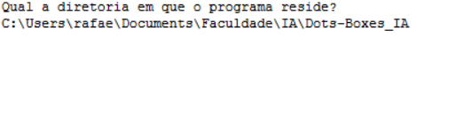
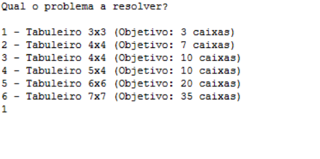
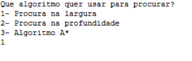
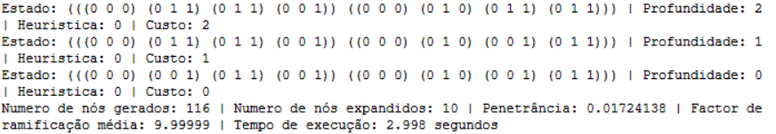

<script type="text/javascript" src="http://cdn.mathjax.org/mathjax/latest/MathJax.js?config=TeX-AMS-MML_HTMLorMML"></script>
<script type="text/x-mathjax-config">
  MathJax.Hub.Config({ tex2jax: {inlineMath: [['$', '$']]}, messageStyle: "none" });
</script>

# Manual de Utilizador

<center>

## **Dots & Boxes**


>IPS ESTS - Licenciatura Engenharia Informatica - 2022/2023
>
>Inteligência Artificial
>\
>Docente: Joaquim Filipe
>
>Trabalho realizado por:
>
>Nome: Daniel Baptista - Nº:202001990
>\
>Nome: Rafael Silva - Nº:202001553
>

</center>

---
<div style="page-break-after: always; break-after: page;"></div>

## 1. Acrónimos e Convenções usadas

* **Tabuleiro** - Onde o jogo é realizado.
  * Este é constituido por:
    * **$n$** -> Linhas de caixas.
    * **$m$** -> Colunas de caixas.
* **Caixa Fechada** - É um objeto no tabuleiro constituído por 4 pontos ligados por 4 arcos, sendo o objetivo do jogo ter estas caixas.
* **Ponto** - Pontos do tabuleiro
  * No total no tabuleiro existem $(n + 1) * (m + 1)$ pontos.
* **Arco** - É a ligação entre dois pontos próximos
  * No total no tabuleiro existem $(m *(n + 1)) + (n* (m + 1))$ arcos.
* **Jogada** - É o turno do jogador em que escolhe onde vai colocar o seu próximo arco.
* **Profundidade** - É o número de níveis que foi necessário o algoritmo percorrer para encontrar o nó desejado.
* **Heurística** - É o processo de ajuda à procura de soluções usando conhecimento prévio.

## 2. Introdução

No âmbito da cadeira de Inteligência Artificial foi realizado um projeto em **_Common Lisp_** de modo a colocar os conhecimentos adquiridos na parte teorica da cadeira a prova. O desafio proposto, pelos docentes da cadeira, para este projeto foi a resolução do jogo "**_Dots and Dashes_**".

O jogo consiste num jogo entre 2 jogadores, não-cooperativo, é um jogo sequencial e de soma zero, em que tem como objetivo final obter o máximo número de caixas fechadas no tabuleiro de jogo.

Foi nos pedido nesta 1ª fase do projeto que só fizessemos a implementação parcial do jogo de modo a obtermos a solução final através dos tabuleiros iniciais disponib ilizados pelos docentes.

## 3. Instalação e utilização

Para utilizar o programa é necessária realizar os seguintes passos:

1. Ter o LispWorks instalado, caso não o tenha pode obte-lo aqui [LispWorks](http://wwwlispworkscomdownloadsindex.html)
2. Colocar os ficheiros da aplicação dentro de uma só pasta.
3. De seguida abrir o ficheiro projeto.lisp no LispWorks através do atalho no canto superior esquerdo "Open file" com o icon seguinte 
4. Depois executar a função iniciar no listener do LispWorks desta forma: ```(iniciar)```

5. Escolher a diretoria onde estão os ficheiros da aplicação. Exemplo: ```"C:\Users\username\Docs\Dots-Boxes_IA"```
6. Selecionar um dos problemas que pretende resolver.
7. Escolher com que algoritmo quer resolver o problema escolhido.

## 5. Input/Output  

### Input

### Output

## 6. Exemplo de aplicação

1. O utilizador deverá executar a função iniciar como já referido anteriormente.

<center>
  <figure>
    
       <figcaption> Ecrã Inicial </figcaption>
  </figure>
</center>

2. O utilizador deverá de seguida escolher a diretoria onde residem os ficheiros da aplicação.

<center>
  <figure>
    
       <figcaption> Ecrã de Escolha de diretoria </figcaption>
  </figure>
</center>

3. Após a escolha da diretoria o utilizador terá que escolher qual o problema quer resolver.

<center>
  <figure>
    
       <figcaption> Ecrã de Escolha do problema a resolver </figcaption>
  </figure>
</center>

4. De seguida o utilizador escolherá qual o algoritmo que pretende utilizar para resolver o problema selecionado.

<center>
  <figure>
    
       <figcaption> Ecrã de Escolha do algoritmo de pesquisa </figcaption>
  </figure>
</center>

5. Por fim o utilizador irá receber as estatisticas após o algoritmo resolver o problema.

<center>
  <figure>
    
       <figcaption> Ecrã de Estatisticas de resolução do problema </figcaption>
  </figure>
</center>
