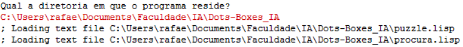

<script type="text/javascript" src="http://cdn.mathjax.org/mathjax/latest/MathJax.js?config=TeX-AMS-MML_HTMLorMML"></script>
<script type="text/x-mathjax-config">
  MathJax.Hub.Config({ tex2jax: {inlineMath: [['$', '$']]}, messageStyle: "none" });
</script>

# Manual de Utilizador

<center>

## **Dots & Boxes**


>IPS ESTS - Licenciatura Engenharia Informatica - 2022/2023
>
>Inteligência Artificial
>\
>Docente: Joaquim Filipe
>
>Trabalho realizado por:
>
>Nome: Daniel Baptista - Nº:202001990
>\
>Nome: Rafael Silva - Nº:202001553
>

</center>

---
<div style="page-break-after: always; break-after: page;"></div>

## 1. Acrónimos e Convenções usadas

* **Tabuleiro** - Onde o jogo é realizado.
  * Este é constituido por:
    * **$n$** -> Linhas de caixas.
    * **$m$** -> Colunas de caixas.
* **Caixa Fechada** - É um objeto no tabuleiro constituído por 4 pontos ligados por 4 arcos, sendo o objetivo do jogo ter estas caixas.
* **Ponto** - Pontos do tabuleiro
  * No total no tabuleiro existem $(n + 1) * (m + 1)$ pontos.
* **Arco** - É a ligação entre dois pontos adjacentes
  * No total no tabuleiro existem $(m *(n + 1)) + (n* (m + 1))$ arcos.
* **Profundidade** - É o nível em que se encontra um determinado nó.
* **Heurística** - É o processo de ajuda à procura de soluções usando conhecimento prévio.

## 2. Introdução

No âmbito da cadeira de Inteligência Artificial foi realizado um projeto em **_Common Lisp_** de modo a colocar os conhecimentos adquiridos na parte teorica da cadeira a prova. O desafio proposto, pelos docentes da cadeira, para este projeto foi a resolução do jogo "**_Dots and Boxes_**".

O jogo consiste num jogo entre 2 jogadores, não-cooperativo, é um jogo sequencial de soma zero, em que tem como objetivo final obter o número máximo de caixas fechadas no tabuleiro de jogo.

Nesta 1ª fase do projeto foi apenas pedido uma implementação parcial deste jogo, em que invés de ser 2 jogadores a jogar, é apenas 1, o próprio computador. Desta forma, o objetivo do jogo nesta fase torna-se em escolher um problema e o algoritmo de procura desejado, e tentar arranjar uma solução para o número de caixas fechadas do problema dado.

## 3. Instalação e utilização

Para utilizar o programa é necessária realizar os seguintes passos:

**1.** Ter o LispWorks instalado, caso não o tenha pode obte-lo aqui [LispWorks](http://wwwlispworkscomdownloadsindex.html)

**2.** Colocar os ficheiros da aplicação dentro de uma só pasta.

**3.** De seguida abrir o ficheiro projeto.lisp no LispWorks através do atalho no canto superior esquerdo "Open file" com o icon seguinte 

**4.** Com o botão direito do rato na janela do Editor, selecionar a opção "Buffer" e de seguida a opção "Evaluate".

**5.** Depois executar a função iniciar no listener do LispWorks desta forma: ```(iniciar)```

**6.** Escolher a diretoria onde estão os ficheiros da aplicação. Exemplo: ```"C:\Users\username\Docs\Dots-Boxes_IA"```

**7.** Selecionar um dos problemas que pretende resolver.

**8.** Escolher com que algoritmo quer resolver o problema escolhido.

## 4. Input/Output  

### **Input**

* **Tabuleiro** - É a representação de um tabuleiro que este é constituido por:
  * **Listas horizontais** - Que são ligações entre pontos adjacentes horizontalmente, sendo que 0 significa que não há arco entre dois pontos e 1 significa que existe um arco entre dois pontos.
  * **Listas verticais** - Que são ligações entre pontos adjacentes verticalmente, sendo que 0 significa que não há arco entre dois pontos e 1 significa que existe um arco entre dois pontos.
* **Algoritmo** - É a escolha do algoritmo de procura a usar no problema escolhido.
  * **BFS** - Algoritmo **_Breadth-First Search_**, em que a tradução para português é Algoritmo de **Procura em Largura**, em que o que é feito é percorrer lateralmente os nós e consegue sempre encontrar a solução ótima se esta existir.
  * **DFS** - Algoritmo **_Depth-First Search_**, em que a tradução para português é Algoritmo de **Procura em Profundidade**, em que o que é feito é percorrer verticalmente os nós, este nem sempre encontra a solução ótima e é menos eficiente que o **BFS** e o **A***.
  * **A*** - Algoritmo A* em que o que é feito é utilizar métodos heurísticos em que se avalia os custos dos nós de modo a encontrar os melhores caminhos para a solução final, visto isto este algoritmo consegue sempre encontrar a solução ótima e será o mais eficiente dos outros dois acima falados.
* **Profundidade limite** - É o limite verticalmente até onde o algoritmo **DFS** irá fazer a procura dos nós, ou seja, é o nivel de profundidade até onde se quer que o algoritmo **DFS** pesquise por uma solução.
* **Heuristica a usar** - É a escolha do método heurístico que o algoritmo **A*** irá usar para chegar a solução final do problema, em que pode-se optar por estes dois:
  * **Número de caixas fechadas** - Esta heurística apenas se foca em comparar o número de caixas fechadas no estado atual com o número de caixas necessárias para acabar o problema.
  * **Numero de caixas fechadas e numero de caixas perto de fechar** - Esta heurística é mais eficiente, pois para além de ter a heurística anterior como base, também verifica as caixas com 3 lados fechados e com 2 lados.

### **Output**

* **Solução final** - Devolve uma lista com o caminho percorrido até ao nó solução, a estrutura da mesma é a seguinte:

  1. Devolve o estado que é o estado em que o tabuleiro se encontra quando é encontrado o nó solução;
  2. Devolve a que nível de profundidade foi encontrado esse nó;
  3. Devolve o valor heurístico do nó caso o algoritmo escolhido seja o **A***;
  4. Devolve o valor do custo do nó, ou seja, ```valor heurístico + nível profundidade```;
* **Algoritmo usado** - Qual o algoritmo utilizado.
* **Heurística usada** - Qual a heurística utilizada, só quando se usa o algoritmo **A***.
* **Número de nós gerados** - É o número de nós que foram necessários criar para chegar ao nó solução.
* **Número de nós expandidos** - É o número de nós que foram necessários percorrer para chegar ao nó solução.
* **Penetrância** - É uma medida de eficiência que varia entre 0 e 1 e que quanto mais perto de 0 melhor é o algoritmo usado.
* **Fator de ramificação média** - É uma medida de eficiência em que o intervalo de variação é entre 1 e $+\infty$ e que quanto mais perto de 1 melhor, pois significa que só é necessario ter 1 sucessor para chegar a solução ótima.
* **Tempo de Execução** - É o tempo, em segundos, que o programa demorou a chegar ao nó solução.

## 5. Exemplo de aplicação

1. O utilizador deverá executar a função iniciar como já referido anteriormente.

<center>
  <figure>
    
       <figcaption> Ecrã Inicial </figcaption>
  </figure>
</center>

2. O utilizador deverá de seguida escolher a diretoria onde residem os ficheiros da aplicação.

<center>
  <figure>
    
       <figcaption> Ecrã de Escolha de diretoria </figcaption>
  </figure>
</center>

3. Após a escolha da diretoria o utilizador terá que escolher qual o problema quer resolver.

<center>
  <figure>
    
       <figcaption> Ecrã de Escolha do problema a resolver </figcaption>
  </figure>
</center>

4. De seguida o utilizador escolherá qual o algoritmo que pretende utilizar para resolver o problema selecionado.

<center>
  <figure>
    
       <figcaption> Ecrã de Escolha do algoritmo de pesquisa </figcaption>
  </figure>
</center>

5. Por fim o utilizador irá receber as estatisticas após o algoritmo resolver o problema.

<center>
  <figure>
    
       <figcaption> Ecrã de Estatisticas de resolução do problema </figcaption>
  </figure>
</center>
